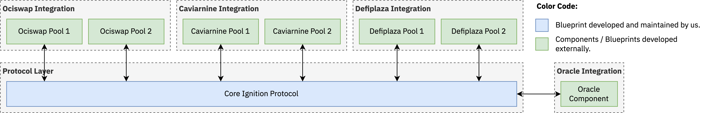

<div align="center">
  <h1><code>Ignition</code></h1>
  <p>
    <strong>Double the value of your liquidity positions on Radix, earn higher fees on them and enjoy impermanent loss protection.</strong>
  </p>
  <p>
    <a href="https://github.com/radixdlt/Ignition/actions/workflows/test.yml?query=branch%3Amain"></a>
    <a href="./LICENSE"></a>
  </p>
</div>

## Introduction

This document covers the technical aspects of Ignition and does not focus so much on the economic or incentives aspect of it beyond the introduction section. If you would like a more detailed explanation of the economic incentives you can find it [here](https://uploads-ssl.webflow.com/6053f7fca5bf627283b582c2/65c3bfd9846b7773b8dd7148_project-Ignition-details.pdf). The hope is that this repository would serve as an example of what a production-ready application written in Scrypto and accompanied by a significant amount of tooling that utilizes the Rust libraries offered in `radixdlt-scrypto` looks like

In simple terms, project Ignition allows users to provide one side of liquidity and for itself to provide the other side of the liquidity. The protocol is not quite made to be profit-generating, its main purpose is to incentivize users to provide liquidity by providing users with several benefits:

* The user's contribution is doubled in value as the user contributes one side of the liquidity and Ignition contributes an equal value of the other side of the liquidity.
* Users get some percentage of rewards upfront depending on how long they want their liquidity to be locked up.
* Users have impermanent loss protection and in most cases are guaranteed to withdraw the same amount of resources that they put in plus fees earned on their position.
* Users earn higher fees on their liquidity positions since their position size is doubled.

This makes Ignition a perfect incentive for users who already own an amount of some of the supported resources (on mainnet this is xUSDT, xUSDC, xwBTC, and xETH) and who wish to provide liquidity with a low downside, upfront rewards, increased fees, and impermanent loss protection.

The user locks their resources for some period allowed by the protocol and based on the length of the lockup period they're given some amount of upfront rewards. The longer the lockup period is, the higher the rewards are. When the period is over, the protocol will try to provide the user with the same amount of resources that they put in plus any trading fees earned in the process (on their resource). If that can't be given, then the protocol will try to provide the user with as much of the protocol resource as possible to make them whole in terms of value, capped by the amount of resources obtained when closing the liquidity position.

In Ignition, the term "protocol resource" refers to the resource that Ignition has and that the protocol is willing to lend out to users when they wish to provide liquidity. The term "user resource" refers to the resource that was provided by the user. So, the protocol and user resources are the two sides of the liquidity that go into a liquidity pool. As an example, the mainnet deployment of Ignition uses XRD as the protocol resource and xUSDT, xUSDC, xwBTC, and xETH as the user resources.

## Technical Requirements

Behavioral, economic, and incentive requirements aside, this section discusses the technical requirements of the complete Ignition system.

| Requirement | Description | 
| ----------- | ----------- |
| All aspects of Ignition must be easily upgradable and modifiable | With the large amount of capital handled by Ignition it must be trivial to upgrade and modify the behavior of the system without needing to wait or rely on a native blueprint upgradeability system to become available in the radix engine. | 
| Ignition must support new exchanges trivially. | It must be trivial for Ignition to support new exchanges that might have not been released at the time of writing Ignition. This means that if Ignition launched with support for exchanges A, B, and C and later on after the release of Ignition a new exchange D was launched then there must be a way for Ignition to support exchange D trivially without needing to move to a new package. |
| Ignition's oracle must be easy to replace. | Ignition uses a price oracle for reasons that we get into later in this document. The oracle used by Ignition must be upgradable such that the oracle doesn't become a single point of failure if an oracle permanently goes out of service or suffers prolonged downtime. Ignition must be able to trivially switch to a new oracle provider at runtime and ideally without the need for a new Ignition package.  | 
| Ignition must not be tied to any protocol resource. | Ignition blueprints should not make the assumption that XRD is the protocol resource since this makes the blueprints difficult to test anywhere where XRD is not in abundance or freely mintable. |
| Ignition must control what pools the users are allowed to contribute to. | Users must not be able to contribute to any pool but only a list of allowed pools. |
| Adding or removing an allowed pool must be trivial | The addition or removal of an allowed pool must not require a new package and must be simple to do. | 
| The ability for positions to be opened and closed must be configurable. | In the case of a bug being discovered it is important that there are is a way for Ignition to halt operation and not allow for new positions to be opened or closed. Much like the other items enabling or disabling opening or closing of liquidity positions must be trivial and easy to do and must not require a new package. | 
| Each supported exchange should have their own liquidity receipt resource with its own unique data. |  |
| Ignition must be resilient to pool price manipulation attacks and ensure that there is a mechanism to detect such price manipulations and deny service when they happen.| | 

## Architecture

An operation that is core to all of Ignition's logic is the ability to call exchanges or pools, get information about them, and then make decisions based on this data. However, the three main exchanges that Ignition needs to integrate with have very different interfaces when it comes to adding liquidity, removing liquidity, and getting the current price of the pool. The table below shows the signature of these methods on pools from the various exchanges:

<table style="width: 100%" >
<tr>
  <td></td>
  <td><strong>Ociswap v2</strong></td>
  <td><strong>Caviarnine v1</strong></td>
  <td><strong>Defiplaza v2</strong></td>
</tr>
<tr>
<td>Adding Liquidity</td>
<td> 

```rust
fn add_liquidity(
    &mut self,
    left_bound: i32,
    right_bound: i32,
    x_bucket: Bucket,
    y_bucket: Bucket
) -> (Bucket, Bucket, Bucket);
```

</td>
<td>

```rust
fn add_liquidity(
    &mut self,
    tokens_x: Bucket,
    tokens_y: Bucket,
    positions: Vec<(u32, Decimal, Decimal)>,
) -> (Bucket, Bucket, Bucket);
```

</td>
<td>

```rust
fn add_liquidity(
    &mut self,
    input_bucket: Bucket,
    co_liquidity_bucket: Option<Bucket>,
) -> (Bucket, Option<Bucket>);
```

</td>
</tr>
<tr>
<td>Removing Liquidity</td>
<td> 

```rust
fn remove_liquidity(
    &mut self,
    lp_positions: NonFungibleBucket
) -> (Bucket, Bucket);
```

</td>
<td>

```rust
fn remove_liquidity(
    &mut self,
    liquidity_receipt: Bucket
) -> (Bucket, Bucket);
```

</td>
<td>

```rust
fn remove_liquidity(
    &mut self,
    lp_bucket: Bucket,
    is_quote: bool,
) -> (Bucket, Bucket);
```

</td>
</tr>
<tr>
<td>Getting Current Price</td>
<td> 

```rust
fn price_sqrt(
    &self
) -> PreciseDecimal;
```

</td>
<td>

```rust
fn get_price(
    &self
) -> Option<Decimal>;
```

</td>
<td>

N/A

</td>
</tr>
</table>

Several potential architectures can be build around this and around how Ignition handles invocations to these pools.

### Potential Architecture 1

<picture>
  <source media="(prefers-color-scheme: dark)" srcset="./diagrams/architecture1-dark.png">
  
</picture>

Starting with a naive and simple architecture where there is a single blueprint for the entire Ignition system and it is the Ignition protocol blueprint that handles all of the protocol-related things such as calculating the upfront reward, impermanent loss protection, fee settlement and so on. In addition to that, the protocol blueprint would also know how to communicate with the pools of the various exchanges to add liquidity, remove liquidity, and get the current price. 

<!-- <picture>
  <source media="(prefers-color-scheme: dark)" srcset="./diagrams/architecture-dark.png">
  
</picture>

<!-- <picture>
  <source media="(prefers-color-scheme: dark)" srcset="./diagrams/architecture-dark.png">
  
</picture>

A major focus in Ignition's architecture is upgradeability and the ability to handle changes in the behavior of the overall system quickly and easily. The architecture also features a clear separation of concerns between the various components used where each component has a concrete and well-defined set of responsibilities that it does. Ignition is split up into two primary layers:

1. The protocol layer: this layer implements the core Ignition protocol and concepts such as an allow-list of pools, the oracle to use, the vaults to store the resources in, whether contributions are allowed, giving upfront rewards, and so on. 
2. The integrations layer: this layer integrates various exchanges so that they work with the Ignition protocol layer. Each integration typically has a single adapter per exchange and  -->

<!-- <div align="center">
  <h1><code>Ignition</code></h1>
  <p>
    <strong>Double the value of your liquidity positions on Radix, earn higher fees on them and enjoy impermanent loss protection.</strong>
  </p>
  <p>
    <a href="https://github.com/radixdlt/Ignition/actions/workflows/test.yml?query=branch%3Amain"></a>
    <a href="./LICENSE"></a>
  </p>
</div>

## Introduction

In simple terms, project Ignition allows users to provide one side of liquidity and for itself to provide the other side of the liquidity. The protocol is not quite made to be profit-generating, its main purpose is to incentivize users to provide liquidity by providing users with several benefits:

* The user's contribution is doubled in value as the user contributes one side of the liquidity and Ignition contributes an equal value of the other side of the liquidity.
* Users get some percentage of rewards upfront.
* Users have impermanent loss protection and in most cases are guaranteed to withdraw the same amount of resources that they put in plus fees earned on their position.
* Users earn higher fees on their liquidity positions since their position size is doubled.

This makes Ignition a perfect incentive for users who already own an amount of some of the supported resources (on mainnet this is xUSDT, xUSDC, xwBTC, and xETH) and who wish to provide liquidity with low downside, upfront rewards, increased fees, and impermanent loss protection.

The user locks their resources for some period allowed by the protocol and based on the length of the lockup period they're given some amount of upfront rewards. The longer the lockup period is, the higher the rewards are. When the period is over, the protocol will try to provide the user with the same amount of resources that they put in plus any trading fees earned in the process (on their resource). If that can't be given, then the protocol will try to provide the user with as much of the protocol resource as possible to make them whole in terms of value, capped by the amount of resources obtained when closing the liquidity position.

In Ignition, the term "protocol resource" refers to the resource that Ignition has and that the protocol is willing to lend out to users when they wish to provide liquidity. The term "user resource" refers to the resource that was provided by the user. So, the protocol and user resources are the two sides of the liquidity that go into a liquidity pool. As an example, the mainnet deployment of Ignition uses XRD as the protocol resource and xUSDT, xUSDC, xwBTC, and xETH as the user resources.

This document is mainly focused on the technical aspects of Ignition such as the architecture, design decisions, and various patterns and does not touch on the economic or incentives aspects at all since they're already explained well [here](https://uploads-ssl.webflow.com/6053f7fca5bf627283b582c2/65c3bfd9846b7773b8dd7148_project-Ignition-details.pdf). The hope is that this repository would serve as an example of a production-ready application written in Scrypto accompanied by a significant amount of tooling that utilizes the Rust libraries offered in `radixdlt-scrypto`.

## Technical Requirements

Behavioral, economic, and incentive requirements aside, this section discusses the technical requirements of the complete Ignition system.

| Requirement | Description | 
| ----------- | ----------- |
| All aspects of Ignition must be easily upgradable and modifiable | With the large amount of capital handled by Ignition it must be trivial to upgrade and modify the behavior of the system without needing to wait or rely on a native blueprint upgradeability system to become available in the radix engine. | 
| Ignition must support new exchanges trivially. | It must be trivial for Ignition to support new exchanges that might have not been released at the time of writing Ignition. This means that if Ignition launched with support for exchanges A, B, and C and later on after the release of Ignition a new exchange D was launched then there must be a way for Ignition to support exchange D trivially without needing to move to a new package. |
| Ignition's oracle must be easy to replace. | Ignition uses a price oracle for reasons that we get into later in this document. The oracle used by Ignition must be upgradable such that the oracle doesn't become a single point of failure if an oracle permanently goes out of service or suffers prolonged downtime. Ignition must be able to trivially switch to a new oracle provider at runtime and ideally without the need for a new Ignition package.  | 
| Ignition must not be tied to any protocol resource. | Ignition blueprints should not make the assumption that XRD is the protocol resource since this makes the blueprints difficult to test anywhere where XRD is not in abundance or freely mintable. |
| Ignition must control what pools the users are allowed to contribute to. | Users must not be able to contribute to any pool but only a list of allowed pools. |
| Adding or removing an allowed pool must be trivial | The addition or removal of an allowed pool must not require a new package and must be simple to do. | 
| The ability for positions to be opened and closed must be configurable. | In the case of a bug being discovered it is important that there are is a way for Ignition to halt operation and not allow for new positions to be opened or closed. Much like the other items enabling or disabling opening or closing of liquidity positions must be trivial and easy to do and must not require a new package. | 
| Each supported exchange should have their own liquidity receipt resource with its own unique data. |  |
| Ignition must be resilient to pool price manipulation attacks and ensure that there is a mechanism to detect such price manipulations and deny service when they happen.| | 


## Architecture

The best way to explain Ignition's architecture is to perhaps examine the challenges and requirements and arrive at this architecture that solves the challenges we faced and that meets all of the technical requirements we have. 

Ignition is set to integrate with three main exchanges: Ociswap v2, Caviarnine v1, and Defiplaza v2. Each one of those exchanges has its own interface when it comes to adding and removing liquidity that is different in its method name, arguments, and returns. The following is an example of that:

<table style="width: 100%" >
<tr>
  <td></td>
  <td><strong>Ociswap v2</strong></td>
  <td><strong>Caviarnine v1</strong></td>
  <td><strong>Defiplaza v2</strong></td>
</tr>
<tr>
<td>Adding Liquidity</td>
<td> 

```rust
fn add_liquidity(
    &mut self,
    left_bound: i32,
    right_bound: i32,
    x_bucket: Bucket,
    y_bucket: Bucket
) -> (Bucket, Bucket, Bucket);
```

</td>
<td>

```rust
fn add_liquidity(
    &mut self,
    tokens_x: Bucket,
    tokens_y: Bucket,
    positions: Vec<(u32, Decimal, Decimal)>,
) -> (Bucket, Bucket, Bucket);
```

</td>
<td>

```rust
fn add_liquidity(
    &mut self,
    input_bucket: Bucket,
    co_liquidity_bucket: Option<Bucket>,
) -> (Bucket, Option<Bucket>);
```

</td>
</tr>
<tr>
<td>Removing Liquidity</td>
<td> 

```rust
fn remove_liquidity(
    &mut self,
    lp_positions: NonFungibleBucket
) -> (Bucket, Bucket);
```

</td>
<td>

```rust
fn remove_liquidity(
    &mut self,
    liquidity_receipt: Bucket
) -> (Bucket, Bucket);
```

</td>
<td>

```rust
fn remove_liquidity(
    &mut self,
    lp_bucket: Bucket,
    is_quote: bool,
) -> (Bucket, Bucket);
```

</td>
</tr>
<tr>
<td>Getting Current Price</td>
<td> 

```rust
fn price_sqrt(
    &self
) -> PreciseDecimal;
```

</td>
<td>

```rust
fn get_price(
    &self
) -> Option<Decimal>;
```

</td>
<td>

N/A

</td>
</tr>
</table>

<picture>
  <source media="(prefers-color-scheme: dark)" srcset="./diagrams/architecture-dark.png">
  
</picture>

> [!NOTE]  
> In the diagram shown above the oracle integration is shown to contain an internally developed oracle adapter and an externally developed oracle component. This is the ideal architecture of Ignition. The current architecture features a single internally developed blueprint and component that acts as both the oracle and the adapter.

The diagram above shows the architecture of Ignition as well as the various components and blueprints that Ignition interacts with. Additionally, it separates between blueprints and components that are part of the Ignition system and others that belong to third-party applications.

Ignition's architecture is modular and very much aligns with the [technical requirements](#technical-requirements) allowing for easy upgradeability of all aspects such as the core protocol, adapters, oracle, or anything else in between.

## Publishing and Bootstrapping

The publishing and bootstrapping of simple applications typically involves 2 transactions: one that publishes the package and another that instantiates a component from the package. Ignition requires significantly more transactions to be instantiated and bootstrapped including transactions for creating the needed badge resources, publishing the packages, instantiating the component, and initializing the components

Ignition has quite a complex publishing and bootstrapping process that is made complex by its [architecture](#architecture) where several packages need to be published and several components need to be instantiated and initialized for Ignition to be fully bootstrapped and ready to be used.

If this process was done manually through the [developer console](https://console.radixdlt.com/) then it would be quite tedious due to the number of packages that need to be published, error-prone due to the number and complexity of the steps, and would 

Ignition's publishing and bootstrapping is more complex than that of other applications partially due to its [architecture](#architecture) and modular design where different parts are split into different packages and blueprints. The process to publish and bootstrap Ignition is as follows:

1. Create a new dApp definition that will be used for the Ignition entities that are created during this process.
1. Creating two badge resources where one is for the protocol owner and manager. -->


