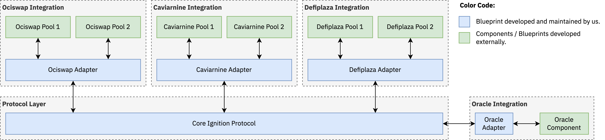

  <h1><code>Ignition</code></h1>
  

    <strong>Double the value of your liquidity positions on Radix, earn higher fees on them and enjoy impermanent loss protection.</strong>
  

  

    
    
  

## Introduction

In simple terms, project Ignition allows users to provide one side of liquidity and for itself to provide the other side of the liquidity. The protocol is not quite made to be profit-generating, its main purpose is to incentivize users to provide liquidity by providing users with several benefits:

* The user's contribution is doubled in value as the user contributes one side of the liquidity and Ignition contributes an equal value of the other side of the liquidity.
* Users get some percentage of rewards upfront.
* Users have impermanent loss protection and in most cases are guaranteed to withdraw the same amount of resources that they put in plus fees earned on their position.
* Users earn higher fees on their liquidity positions since their position size is doubled.

This makes Ignition a perfect incentive for users who already own an amount of some of the supported resources (on mainnet this is xUSDT, xUSDC, xwBTC, and xETH) and who wish to provide liquidity with low downside, upfront rewards, increased fees, and impermanent loss protection.

The user locks their resources for some period allowed by the protocol and based on the length of the lockup period they're given some amount of upfront rewards. The longer the lockup period is, the higher the rewards are. When the period is over, the protocol will try to provide the user with the same amount of resources that they put in plus any trading fees earned in the process (on their resource). If that can't be given, then the protocol will try to provide the user with as much of the protocol resource as possible to make them whole in terms of value, capped by the amount of resources obtained when closing the liquidity position.

In Ignition, the term "protocol resource" refers to the resource that Ignition has and that the protocol is willing to lend out to users when they wish to provide liquidity. The term "user resource" refers to the resource that was provided by the user. So, the protocol and user resources are the two sides of the liquidity that go into a liquidity pool. As an example, the mainnet deployment of Ignition uses XRD as the protocol resource and xUSDT, xUSDC, xwBTC, and xETH as the user resources.

This document is mainly focused on the technical aspects of Ignition such as the architecture, design decisions, and various patterns and does not touch on the economic or incentives aspects at all since they're already explained well [here](https://uploads-ssl.webflow.com/6053f7fca5bf627283b582c2/65c3bfd9846b7773b8dd7148_project-Ignition-details.pdf). The hope is that this repository would serve as an example of a production-ready application written in Scrypto accompanied by a significant amount of tooling that utilizes the Rust libraries offered in `radixdlt-scrypto`.

## Requirements

Behavioral, economic, and incentive requirements aside, this section discusses the technical requirements of the complete Ignition system.

| Requirement | Description | 
| ----------- | ----------- |
| All aspects of Ignition must be easily upgradable and modifiable | With the large amount of capital handled by Ignition it must be trivial to upgrade and modify the behavior of the system without needing to wait or rely on a native blueprint upgradeability system to become available in the radix engine. | 
| Ignition must support new exchanges trivially. | It must be trivial for Ignition to support new exchanges that might have not been released at the time of writing Ignition. This means that if Ignition launched with support for exchanges A, B, and C and later on after the release of Ignition a new exchange D was launched then there must be a way for Ignition to support exchange D trivially without needing to move to a new package. |
| Ignition's oracle must be easy to replace. | Ignition uses a price oracle for reasons that we get into later in this document. The oracle used by Ignition must be upgradable such that the oracle doesn't become a single point of failure if an oracle permanently goes out of service or suffers prolonged downtime. Ignition must be able to trivially switch to a new oracle provider at runtime and ideally without the need for a new Ignition package.  | 
| Ignition must not be tied to any protocol resource. | Ignition blueprints should not make the assumption that XRD is the protocol resource since this makes the blueprints difficult to test anywhere where XRD is not in abundance or freely mintable. |
| Ignition must control what pools the users are allowed to contribute to. | Users must not be able to contribute to any pool but only a list of allowed pools. |
| Adding or removing an allowed pool must be trivial | The addition or removal of an allowed pool must not require a new package and must be simple to do. | 
| The ability for positions to be opened and closed must be configurable. | In the case of a bug being discovered it is important that there are is a way for Ignition to halt operation and not allow for new positions to be opened or closed. Much like the other items enabling or disabling opening or closing of liquidity positions must be trivial and easy to do and must not require a new package. | 
| Each supported exchange should have their own liquidity receipt resource with its own unique data. |  |
| Ignition must be resilient to pool price manipulation attacks and ensure that there is a mechanism to detect such price manipulations and deny service when they happen.| | 

## Architecture

<picture>
  <source media="(prefers-color-scheme: dark)" srcset="./diagrams/architecture-dark.png">
  
</picture>