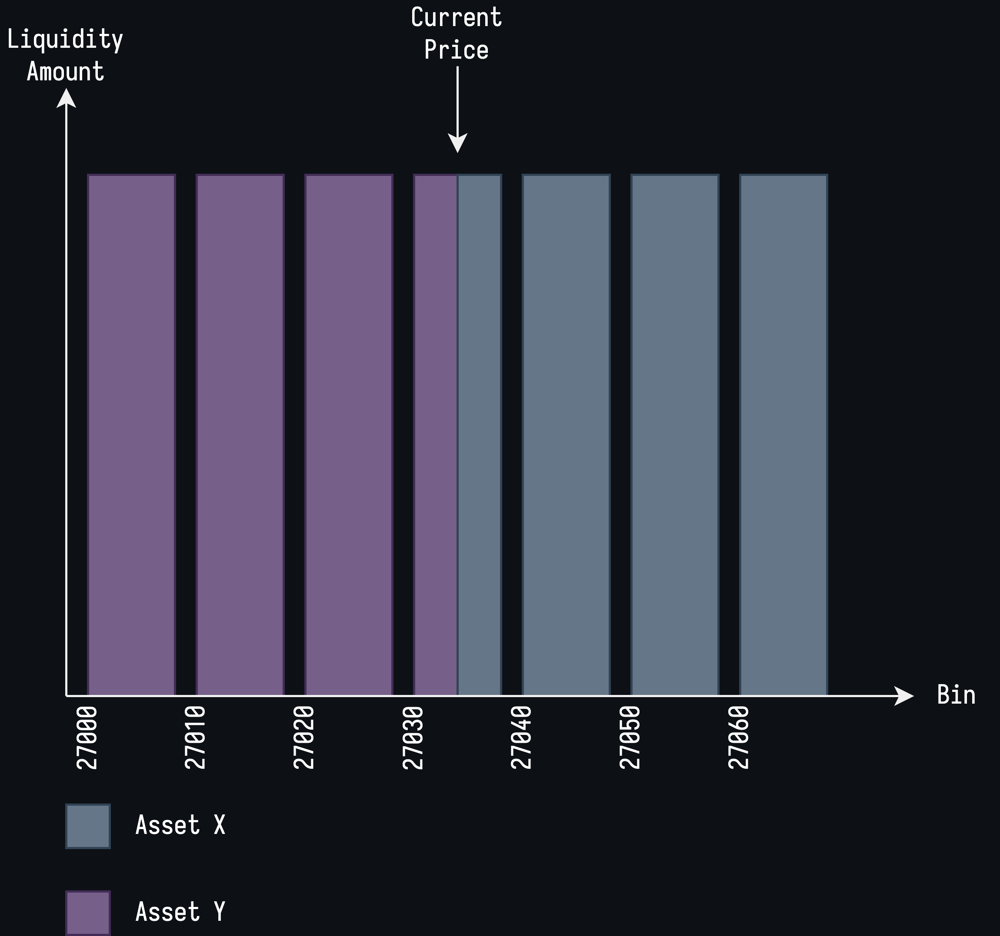

# Caviarnine Adapter

## Calculation of Fees

This section of the document describes how the adapter estimates how much fees have been earned on a liquidity position for the period that it's been opened. There is some amount of knowledge of Caviarnine required to fully understand this calculation which is also described in this section as we go.

First, I will describe some of the basics of Caviarnine that we will build the model on. Caviarnine allows users to concentrate their liquidity in a Uniswap V3 style where users can add liquidity to different bins. A bin is a discrete range in the price range between 0 and infinity. Adding liquidity to a specific bin means that the user's liquidity is only active when the price is inside that bin's range. Once the price exits that of the bin that the user has their assets in then the user stops earning fees. Of course, the user is allowed to add liquidity to multiple different bins so that their liquidity is active in a wider price range.

  

The above diagram depicts the liquidity in some pool that is made up of assets X and Y and the various bins that exist in this pool. The x-axis of the diagram is the bin number. The distance between each bin and the other is called the bin span. In this diagram, the bin span is 10 which we can calculate by subtracting the second bin from the first (27010 - 27000). The bin span is the same throughout the pool and could change for different pools.

The spot price can be calculated from the bin number by using the following equation:

$$
\mathrm{Spot \space Price}(\mathrm{Bin}) = 1.0005 ^ {2\mathrm{Bin} - 54000}
$$

The first bin in the diagram above is 27000 and the last bin starts at 27060 and ends at 27070. With the equation above this means that the diagram has a price range of:

$$
\mathrm{Spot \space Price}(27000) = 1.0005 ^ {54000 - 54000} = 1.0005 ^ 0 = 1
$$

$$
\mathrm{Spot \space Price}(27070) = 1.0005 ^ {54140 - 54000} = 1.0005 ^ {140} = 1.07248941878
$$

The y-axis in the diagram represents the amount of liquidity in each of the bins. To simplify things, this diagram assumes that each of the bins contains an equal amount of liquidity, which is of course not realistic but simplifies things.

The bin where the current price of the asset lies is called the _active bin_. Not all bins hold both the X and Y assets:

* The currently active bin is the only bin that holds both X and Y assets.
* All bins above the active bin hold X assets
* All bins below the active bin hold Y assets

This is seen in the diagram with the two different colors used for the bins and the active bin (the middle one) being split in half containing both of the colors. 

> This bit is not too relevant to the calculation of fees or anything, but is relevant for the overall understanding of the reader on the Caviarnine system. As you've read above, some of the bins only contain one of the assets and not both. Therefore, unlike Uniswap V2 where the users are obligated to provide two assets of equal value to the pool, the users in this case are not obligated to do that. A user can provide a single side of the liquidity or provide both as they see fit.